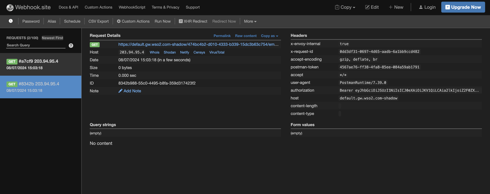

# Mirroring Requests via APK Conf

This functionality enables request mirroring, where a request can be duplicated and sent to multiple backends for testing and monitoring. This guide explains how to enable request mirroring via the APK-Conf file.

### Step 1 - Get the API configuration

Here, you can follow the steps in [Create an API](../../../get-started/quick-start-guide.md) documentation and save this content into a file named `EmployeeService.apk-conf`. You can use this apk-conf file for the rest of this guide.

### Step 2 - Add the request mirroring policy to the apk-conf file

A sample request mirror configuration is given below.
For this guide, it's best to use a webhook.site URL for both the production and request mirroring endpoints to view the duplicate requests. Replace the `WEBHOOK_URL` with a relevant webhook url from the site `https://webhook.site`. Ensure that you keep this webpage open to view the incoming requests.

```
  - target: "/employee"
    verb: "GET"
    secured: false
    scopes: []
    operationPolicies:
      request:
        - policyName: RequestMirror
          policyVersion: v1
            parameters:
              urls:
                - `WEBHOOK_URL`
```

This policy mirrors the request to the production/sandbox endpoint, as well as the relevant mirror URL.

The complete apk-conf file with this configuration is given below.

```
id: "header-modifier-api"
name: "EmployeeServiceAPI"
basePath: "/employee"
version: "1.0"
type: "REST"
defaultVersion: false
endpointConfigurations:
    production:
        endpoint: `WEBHOOK_URL`
operations:
- target: "/employee"
  verb: "GET"
  secured: false
  scopes: []
  operationPolicies:
    request:
      - policyName: RequestMirror
        policyVersion: v1
          parameters:
            urls:
              - `WEBHOOK_URL`
- target: "/employee"
    verb: "POST"
    secured: true
    scopes: []
- target: "/employee/{employeeId}"
    verb: "PUT"
    secured: true
    scopes: []
- target: "/employee/{employeeId}"
    verb: "DELETE"
    secured: true
    scopes: []
```

### Step 3 - Deploy the API in APK

Refer to the [Deploy the API in APK](../../../get-started/quick-start-guide.md#deploy-the-api-in-apk) to deploy the API using APK configuration.

### Step 4 - Generate an access token

Follow the [Generate Access Token](../../../develop-and-deploy-api/security/generate-access-token.md) documentation to generate an access token.

### Step 5 - Invoke the API

You can invoke the API using the following command.

```
curl --location 'https://default.gw.wso2.com:9095/employee/1.0/employee' \
--header 'Host: default.gw.wso2.com' \
--header 'Authorization: Bearer <accessToken>
```

Once you have invoked the above, you can view the duplicated requests in the webhook.site page as follows.

[](../../../assets/img/api-management/api-policies/webhook-site-request-mirroring.png)


